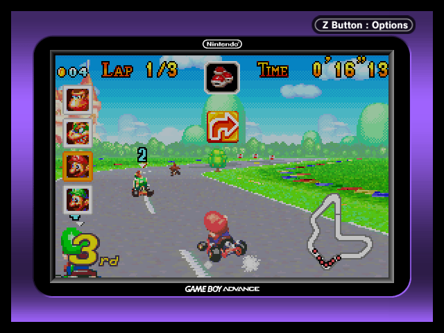
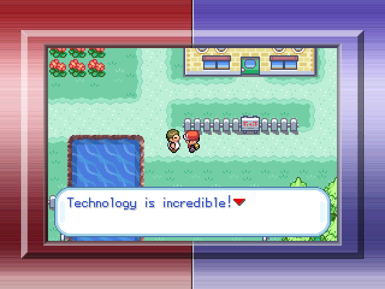
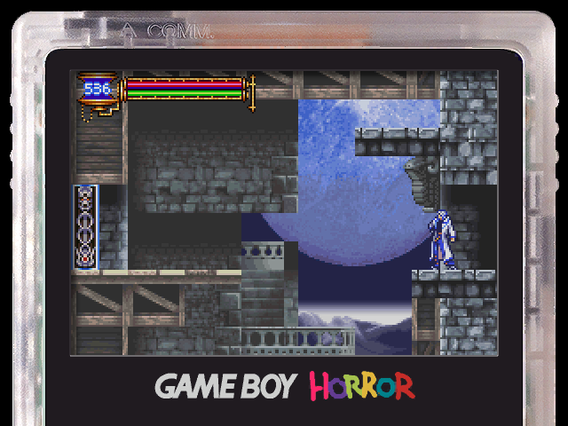
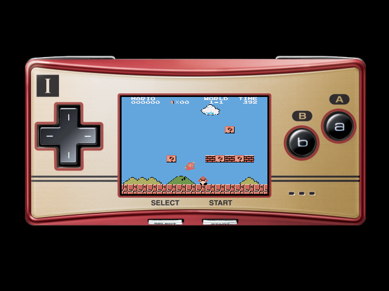

# GBA-640x480-Integer-Overlays-RA
So you've got a device with a 640x480 screen, you want to play GBA games with integer scaling and don't want to deal with the enormous black void left around the game. Fret no longer! You can cover it up with this set of RetroArch overlays.

It includes recreations of every GameCube Game Boy Player border, along with Luigi's Mansion's Game Boy Horror and two Game Boy Micro borders (with bonus 1x scaling versions!)

Game Boy Player graphics ripped by Mr. C  
Game Boy Horror graphics ripped by silasjohn

## Examples

